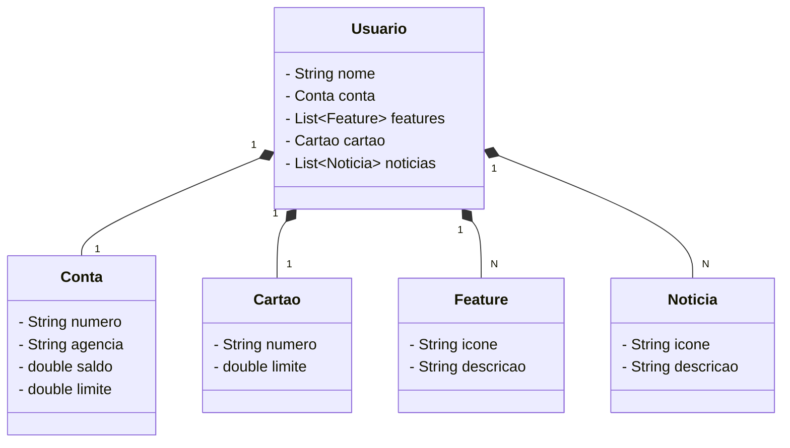

# Santander Bootcamp - Java API RESTful
## Descrição do Projeto

Este projeto é uma API RESTful desenvolvida em Java utilizando o framework Spring Boot. A API permite a gestão de usuários, cartões, contas, features e notícias. O projeto foi desenvolvido como parte do Santander Bootcamp 2024 - Backend com Java.

## Diagrama de Classes




## Tecnologias Utilizadas

- Java 17
- Spring Boot 3.3.1
- Spring Data JPA
- PostgreSQL
- Maven
- Gradle (opcional)

## Funcionalidades

- **Usuários**
  - Consultar usuário por ID
  - Criar novo usuário

- **Cartões**
  - Consultar cartão por ID
  - Criar novo cartão

- **Contas**
  - Consultar conta por ID
  - Criar nova conta

- **Features**
  - Consultar feature por ID
  - Criar nova feature

- **Notícias**
  - Consultar notícia por ID
  - Criar nova notícia

## Como Executar o Projeto

### Pré-requisitos

- Java 17
- Maven ou Gradle
- PostgreSQL

### Passo a Passo

#### Usando Maven

1. Clone o repositório:

    ```bash
    git clone https://github.com/AriJunior09/Santander-Dev-Bootcamp-2024.git
    ```

2. Navegue até o diretório do projeto:

    ```bash
    cd Santander-Dev-Bootcamp-2024
    ```

3. Configure o banco de dados PostgreSQL no arquivo `application-prod.yml`:

    ```yaml
    spring:
      profiles:
        active: prod
      datasource:
        url: jdbc:postgresql://${PGHOST}:${PGPORT}/${PGDATABASE}
        username: ${PGUSER}
        password: ${PGPASSWORD}
      jpa:
        hibernate:
          ddl-auto: create
    ```

4. Compile e execute o projeto:

    ```bash
    mvn spring-boot:run
    ```

5. Acesse a API em `http://localhost:8080`.

#### Usando Gradle

1. Clone o repositório:

    ```bash
    git clone https://github.com/AriJunior09/Santander-Dev-Bootcamp-2024.git
    ```

2. Navegue até o diretório do projeto:

    ```bash
    cd Santander-Dev-Bootcamp-2024
    ```

3. Configure o banco de dados PostgreSQL no arquivo `application-prod.yml`:

    ```yaml
    spring:
      profiles:
        active: prod
      datasource:
        url: jdbc:postgresql://${PGHOST}:${PGPORT}/${PGDATABASE}
        username: ${PGUSER}
        password: ${PGPASSWORD}
      jpa:
        hibernate:
          ddl-auto: create
    ```

4. Compile e execute o projeto:

    ```bash
    ./gradlew bootRun
    ```

5. Acesse a API em `http://localhost:8080`.

## Endpoints da API

### Usuários

- **GET /users/{id}**
  - Retorna um usuário por ID.

- **POST /users**
  - Cria um novo usuário.

### Cartões

- **GET /cartoes/{id}**
  - Retorna um cartão por ID.

- **POST /cartoes**
  - Cria um novo cartão.

### Contas

- **GET /contas/{id}**
  - Retorna uma conta por ID.

- **POST /contas**
  - Cria uma nova conta.

### Features

- **GET /features/{id}**
  - Retorna uma feature por ID.

- **POST /features**
  - Cria uma nova feature.

### Notícias

- **GET /noticias/{id}**
  - Retorna uma notícia por ID.

- **POST /noticias**
  - Cria uma nova notícia.

## Estrutura do Projeto

```plaintext
santander_bootcamp
├── controller
│   └── UserController.java
├── model
│   ├── BaseItem.java
│   ├── Cartao.java
│   ├── Conta.java
│   ├── Features.java
│   ├── Noticias.java
│   └── Usuario.java
├── repository
│   └── UsuarioRepositorio.java
├── servico
│   ├── impl
│   │   └── UserServiceImpl.java
│   └── UserService.java
└── Application.java

```
## Contribuição

Contribuições são bem-vindas! Sinta-se à vontade para abrir issues e enviar pull requests.

## Licença
Este projeto está licenciado sob a licença MIT - veja o arquivo LICENSE para detalhes.


### Autor
Este projeto foi desenvolvido por **Ari Junior**

- **LinkedIn:** https://www.linkedin.com/in/arijunior09/
- **GitHub:** https://github.com/AriJunior09

### Recursos do Spring

- **Documentação do Spring Boot:** [https://spring.io/projects/spring-boot](https://spring.io/projects/spring-boot)
- **Documentação do Spring Data JPA:** [https://spring.io/projects/spring-data-jpa](https://spring.io/projects/spring-data-jpa)
- **Guia do Spring Framework:** [https://spring.io/guides](https://spring.io/guides)
- **Documentação do Spring Security:** [https://spring.io/projects/spring-security](https://spring.io/projects/spring-security)
- **Documentação do Spring Web:** [https://spring.io/guides/gs/rest-service/](https://spring.io/guides/gs/rest-service/)
- **Documentação do Spring Boot OpenAPI:** [https://springdoc.org/](https://springdoc.org/)
