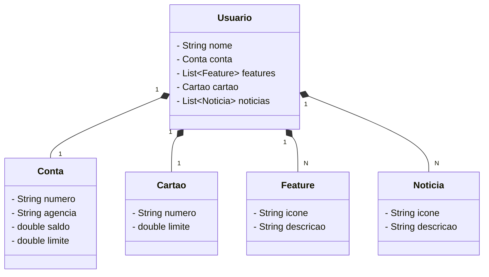

# Santander Dev Bootcamp 2024
Java RESTful API - Criada para o Santander Bootcamp Dev Backend 2024

## Diagrama de Classes

```mermaid
classDiagram
    class Usuario {
        - String nome
        - Conta conta
        - List~Feature~ features
        - Cartao cartao
        - List~Noticia~ noticias
    }

    class Conta {
        - String numero
        - String agencia
        - double saldo
        - double limite
    }

    class Feature {
        - String icone
        - String descricao
    }

    class Cartao {
        - String numero
        - double limite
    }

    class Noticia {
        - String icone
        - String descricao
    }

    Usuario "1" *-- "1" Conta
    Usuario "1" *-- "1" Cartao
    Usuario "1" *-- "N" Feature
    Usuario "1" *-- "N" Noticia
```
